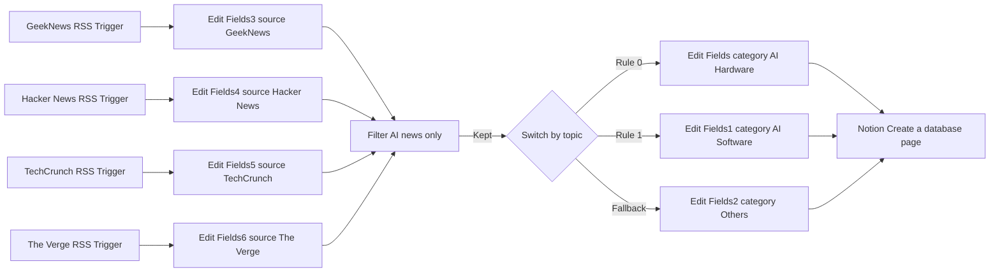
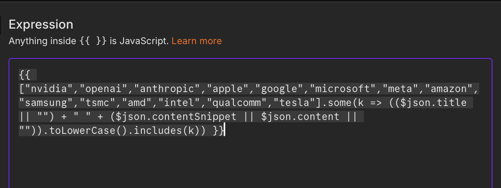
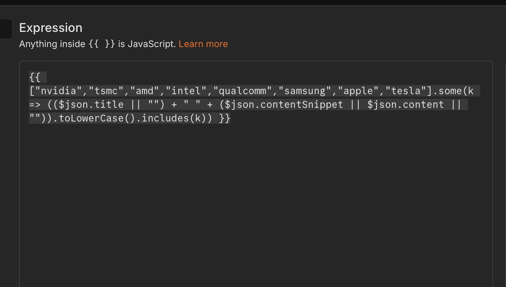
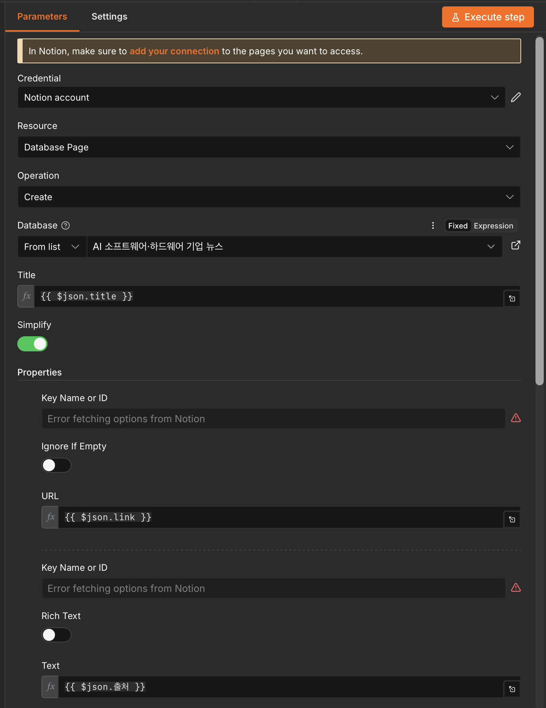
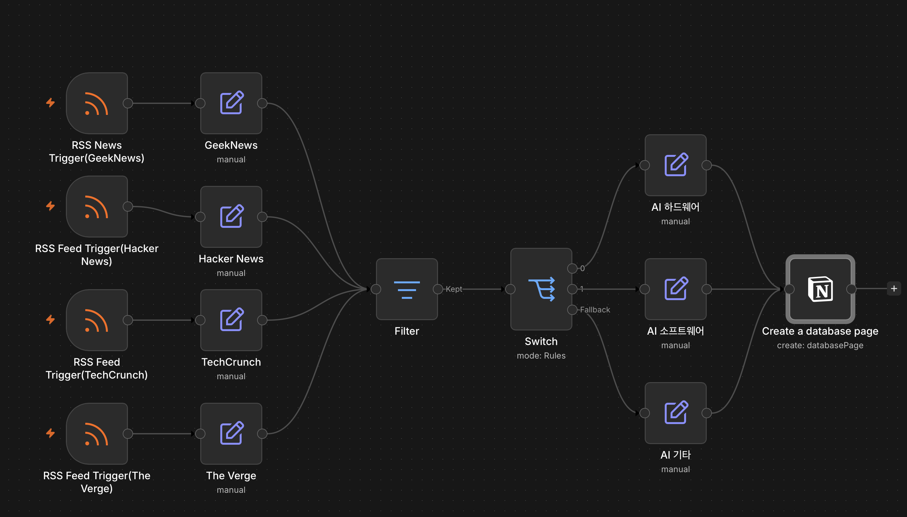
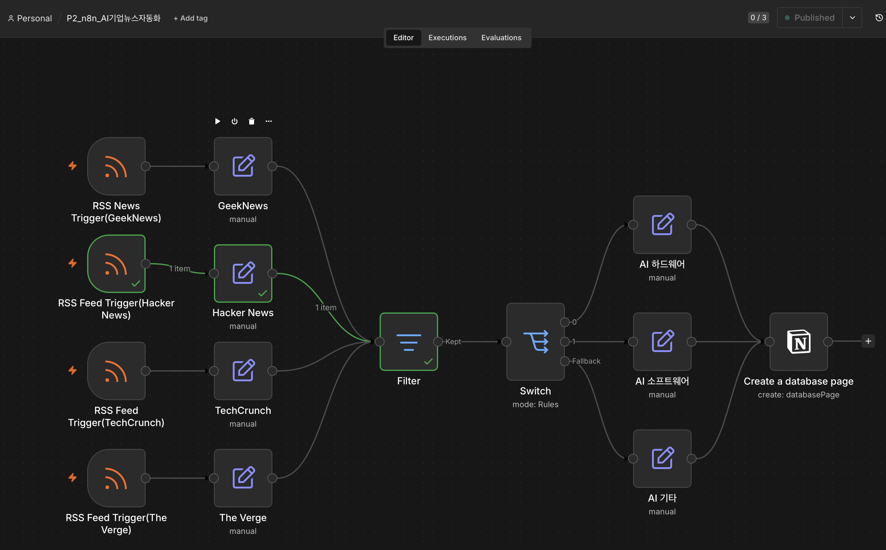
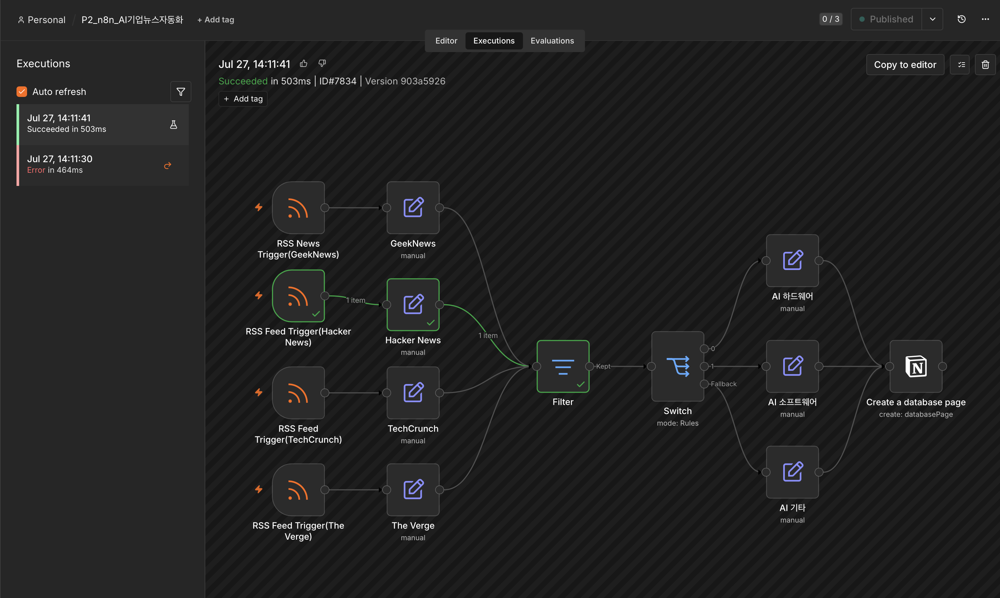
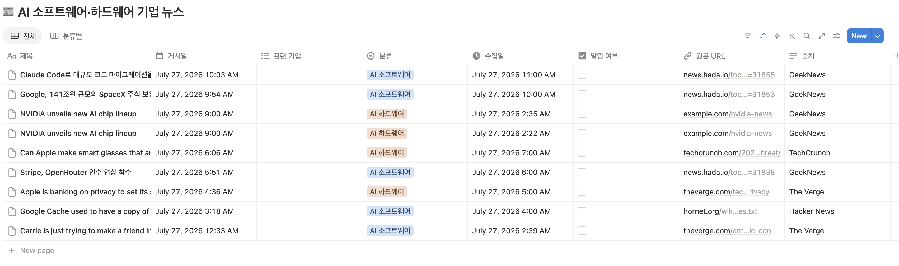

> RSS 피드에서 AI 관련 뉴스를 자동 수집·분류하여 [Notion 데이터베이스](https://www.notion.so/3910d527295080159d9cce9a214f44de)에 저장하는 [n8n](http://116.126.134.212:55678/signin?redirect=%252F) 자동화 워크플로우
​
---
​
## 1. 자동화할 반복 업무 정의
​
### 기존 수작업 프로세스
매일 AI 업계 동향을 파악하기 위해 아래 작업을 반복 수행:
​
1. 뉴스 사이트 4곳(GeekNews, Hacker News, TechCrunch, The Verge)에 직접 접속
2. 최신 기사 목록을 훑어보며 AI 관련 기사 선별
3. 기사 제목, 링크, 출처를 Notion에 수동 복사·붙여넣기
4. 기사를 주제별(AI 하드웨어 / AI 소프트웨어 / 기타)로 분류
​
### 문제점
| 문제 | 내용 |
|------|------|
| 시간 소모 | 매일 약 20~30분 소요 |
| 누락 위험 | 확인하지 않는 시간대의 기사를 놓침 |
| 일관성 부족 | 수동 분류 기준이 매번 달라질 수 있음 |
| 단순 반복 | 판단보다 복사·붙여넣기 위주의 저부가가치 작업 |
​
### 자동화 목표
- 4개 뉴스 소스를 **매시간 자동 모니터링**
- **AI 관련 기사만 필터링**하여 노이즈 제거
- **주제별 자동 분류** 후 Notion 데이터베이스에 저장
​
---
​
## 2. 자동화 도구 선정 및 선정 이유
​
### 선정 도구: **n8n**
​
### 선정 이유
​
| 기준 | n8n의 장점 |
|------|-----------|
| 비용 | 오픈소스 기반, 무료로 충분한 실행 횟수 확보 가능 |
| 노코드 구현 | 시각적 노드 기반 편집기로 코드 없이 워크플로우 구성 |
| 트리거 지원 | RSS Feed Trigger 노드 기본 제공 (Poll 주기 설정 가능) |
| 분기 로직 | Filter, Switch 노드로 조건 필터링·다중 분기 처리 용이 |
| Notion 연동 | 공식 Notion 노드로 데이터베이스 페이지 생성 지원 |
| 확장성 | 추후 Slack 알림, AI 요약 등 노드 추가로 확장 가능 |
​
### 대안 도구와의 비교
- **Zapier**: 무료 플랜의 실행 횟수(Task) 제한이 엄격하고, 다중 분기 구성 시 유료 플랜 필요
- **Make**: 시나리오 구성은 유연하나 학습 곡선이 상대적으로 높음
- **n8n**: 무료로 복잡한 분기 처리 가능 + 셀프호스팅 옵션 → **최종 선정**
​
---
​
## 3. 워크플로우 설계 문서
​
### 3-1. 전체 아키텍처
​

​
### 3-2. 노드별 상세 설계
​
| 단계 | 노드 | 역할 | 주요 설정 |
|------|------|------|----------|
| 1 | RSS Feed Trigger ×4 | 뉴스 소스별 신규 기사 감지 | Poll Time: Every Hour |
| 2 | Edit Fields3~6 | 트리거별 출처(source) 필드 추가 | Include Other Input Fields: ON |
| 3 | Filter | AI 관련 키워드 포함 기사만 통과 | 제목 기반 키워드 조건 |
| 4 | Switch (mode: Rules) | 주제별 3분기 라우팅 | 규칙 매칭 + Fallback |
| 5 | Edit Fields / 1 / 2 | 분기별 카테고리 필드 지정 | Include Other Input Fields: ON |
| 6 | Notion – Create a database page | Notion DB에 기사 저장 | 제목·링크·출처·카테고리 매핑 |
​
### 3-3. 데이터 흐름 (필드 매핑)
​
```
RSS 기사 → { title, link, pubDate }
        → + source (출처 태깅)
        → + category (Switch 분기 결과)
        → Notion 페이지 속성으로 매핑
```
​
### 3-4. 설계 시 주요 의사결정
​
1. **트리거별 출처 노드 분리**
   - RSS 데이터 자체에는 출처 정보가 없어, 각 트리거 직후 Edit Fields로 출처를 태깅
​
2. **Include Other Input Fields 활성화**
   - Edit Fields 노드는 기본적으로 새 필드만 출력 → 기존 필드(제목, 링크)가 유실되는 문제 발생
   - 모든 Edit Fields 노드에서 해당 옵션을 ON으로 설정하여 해결
​
3. **Filter → Switch 2단계 구조**
   - Filter: AI 무관 기사를 먼저 제거 (노이즈 감소)
   - Switch: 통과한 기사만 주제별 분류 (Fallback으로 미분류 방지)
​
4. **Poll 주기: Every Hour**
   - 테스트용 Every Minute 설정 제거, 실사용 기준 매시간 실행으로 정리
​
---
​
## 4. 구현 화면
​
### 4-1. 전체 워크플로우
​

​
### 4-2. Filter 노드 설정 (AI 키워드 필터링)
​

​
### 4-3. Switch 노드 설정 (주제별 분기 규칙)
​

​
### 4-4. Notion 노드 설정 (필드 매핑)
​

​
---
​
## 5. 실행 결과
​
### 5-1. 워크플로우 활성화 (Published 상태)
​

​
### 5-2. 자동 실행 기록 및 실행 성공 상세
​

​
### 5-3. Notion 데이터베이스 저장 결과
​

​
---
​
## 6. 회고
​
### 배운 점
- Edit Fields 노드의 필드 유실 문제와 `Include Other Input Fields` 옵션의 중요성
- Filter(사전 필터링)와 Switch(분기)를 조합한 데이터 라우팅 설계
- 다중 트리거 환경에서 출처 정보를 보존하는 패턴
​
### 향후 개선 아이디어
- [ ] AI 노드를 추가해 기사 본문 자동 요약 후 Notion에 저장
- [ ] 중요 기사 발견 시 Slack/Discord 알림 연동
- [ ] 중복 기사 제거 로직 추가
​
