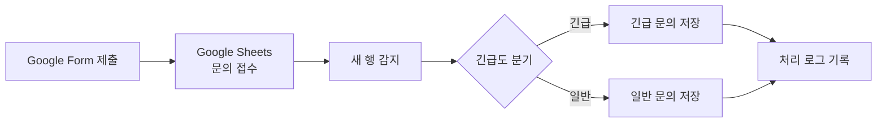

# Make vs n8n 비교 분석 보고서

<aside>
⚖️

**비교 대상:** Make Free와 로컬 셀프 호스팅 n8n Community Edition

**공통 워크플로우:** Google Form 문의 접수 → Google Sheets 새 행 감지 → 긴급도 조건 분기 → 분류 시트 저장 → 처리 로그 기록

</aside>

## 1. 프로젝트 개요

### 1.1 자동화 대상 업무

Google Form으로 접수되는 문의를 사람이 매번 확인해 `긴급`과 `일반`으로 분류하고 처리 이력을 기록하는 반복 업무를 자동화했다. 동일한 입력 데이터와 Google Sheets 구조를 사용해 Make와 n8n에서 각각 구현했다.

### 1.2 공통 데이터 구조

- **입력:** Google Form `IT 문의 접수 테스트`
- **원본 탭:** `문의 접수`
- **출력 탭:** `긴급 문의`, `일반 문의`, `처리 로그`
- **분기 기준:** `긴급도 = 긴급` 또는 `긴급도 = 일반`
- **처리도구 기록:** Make 실행은 `Make`, n8n 실행은 `n8n`

### 1.3 사용 도구

- **Make Free:** 클라우드 기반 시각적 자동화 플랫폼
- **n8n Community Edition:** Mac의 Docker에서 실행한 로컬 셀프 호스팅 자동화 플랫폼

구현 상세 기록:

- Make: P1 Make by Fable 5
- n8n: 프로젝트 1 — n8n

---

## 2. 공통 기능 요구사항 충족 구조

| 요구사항 | Make | n8n |
| --- | --- | --- |
| Trigger 1개 이상 | Google Sheets — Watch New Rows | Google Sheets — On row added |
| Action 2개 이상 | Add a Row × 3 | 각 분기별 Append Row × 2 |
| 조건 분기 | Router + 경로별 Filter | Switch — Rules |
| 자동 실행 | 스케줄 기반 폴링 | Published Workflow의 1분 폴링 |
| 실행 이력 | Scenario History 및 모듈 실행 뱃지 | Executions 및 노드별 입출력 |

<aside>
⚠️

**검증 상태:** n8n은 긴급·일반 분기의 Published 자동 실행을 각각 확인했다. Make는 시나리오 로직 구성을 완료했지만, Make 구현 기록 기준으로 긴급·일반 엔드투엔드 실행과 결과 캡처가 아직 남아 있다. 제출 전 두 경로를 각각 1회 실행해 증빙을 추가해야 한다.

</aside>

---

## 3. Make 구현 과정

### 3.1 시나리오 구성

1. **Google Sheets — Watch New Rows**
    - `문의 접수` 탭의 새 행을 감지한다.
    - 폴링 방식이며 스케줄에 따라 실행된다.
2. **Router**
    - 데이터를 3개 경로로 전달한다.
3. **긴급 경로**
    - Filter: `긴급도 = 긴급`
    - Add a Row: `긴급 문의` 탭에 저장
4. **일반 경로**
    - Filter: `긴급도 = 일반`
    - Add a Row: `일반 문의` 탭에 저장
5. **전체 로그 경로**
    - 필터 없이 모든 데이터를 통과시킨다.
    - Add a Row: `처리 로그` 탭에 저장
    - `if()` 함수로 긴급도에 따른 분기결과를 기록한다.
    - `now()` 함수로 처리시각을 기록한다.

### 3.2 Make에서 겪은 문제

- **Google Sheets 403 권한 오류**
    - 원인: 기존 Google 연결의 권한 승인 문제
    - 해결: Google 계정을 재연결하고 권한을 다시 승인
- **Run once에서 Router 이후 모듈이 실행되지 않음**
    - 원인: 실행 이후 새 Form 응답이 없어 Watch New Rows가 전달할 데이터가 없었음
    - 해결: 새 Form 응답을 제출하거나 `Choose where to start`로 Trigger 포인터를 조정

### 3.3 Make 구현의 특징

Make는 분류 경로와 전체 로그 경로를 Router에서 각각 독립적으로 구성했다. 분기 결과는 처리 로그 경로에서 `if()` 함수로 계산했기 때문에, n8n처럼 긴급·일반 경로마다 로그 노드를 별도로 둘 필요가 없었다.

---

## 4. n8n 구현 과정

### 4.1 로컬 실행 환경

- Mac에서 Docker Desktop 실행
- n8n Community Edition 컨테이너 사용
- 접속 주소: `http://localhost:5678`
- Google Sheets Trigger 및 Action을 위해 Google Cloud에서 Sheets API와 Drive API 활성화
- External OAuth 앱, Web application Client, Redirect URI 및 Test user 구성

### 4.2 워크플로우 구성

1. **문의 접수 감지**
    - Google Sheets `On row added`
    - `문의 접수` 탭을 매분 확인
2. **긴급도 분기**
    - Switch의 Rules 모드 사용
    - 출력 1: `긴급도 = 긴급`
    - 출력 2: `긴급도 = 일반`
3. **긴급 경로**
    - `긴급 문의 저장`: 긴급 문의 탭에 Append Row
    - `긴급 처리 로그`: 처리 로그 탭에 Append Row
4. **일반 경로**
    - `일반 문의 저장`: 일반 문의 탭에 Append Row
    - `일반 처리 로그`: 처리 로그 탭에 Append Row
5. **처리시각**
    - Expression에서 Asia/Seoul 시간대로 변환 후 `yyyy-MM-dd HH:mm:ss` 형식으로 기록

### 4.3 n8n에서 겪은 문제

- **셀프 호스팅 Google OAuth 설정 필요**
    - Google Cloud 프로젝트, API, OAuth Client ID/Secret을 직접 구성해야 했다.
- **Trigger와 Action Credential 유형 차이**
    - Trigger용과 Action용 Credential을 각각 만들되 동일한 Client ID/Secret을 재사용했다.
- **빈 열이 `Column 6`으로 감지됨**
    - `긴급도` 오른쪽 빈 열을 삭제해 해결했다.
- **처리시각에 `$now`가 문자열로 저장됨**
    - Fixed가 아닌 Expression 모드로 변경하고 이중 중괄호 안에서 서울 시간 변환식을 사용했다.
- **수동 테스트에서 기존 긴급 행도 재처리됨**
    - Trigger가 기존 행과 새 행을 함께 읽어 2 items를 전달한 것이 원인이었다.
    - 최종 테스트 전 데이터 행을 정리하고 Published 상태에서 새 문의만 제출해 해결했다.

### 4.4 n8n 자동 실행 검증

긴급과 일반 문의를 각각 새로 제출해 다음을 확인했다.

- 긴급 문의 → 긴급 문의 탭 + 긴급 처리 로그
- 일반 문의 → 일반 문의 탭 + 일반 처리 로그
- 실행되지 않은 반대 경로에는 데이터가 전달되지 않음
- Published 상태에서 Form 제출만으로 자동 실행

---

## 5. Make와 n8n 비교 분석

| 비교 항목 | Make | n8n |
| --- | --- | --- |
| 실행 환경 | 클라우드 서비스로 별도 설치 불필요 | Docker 기반 로컬 셀프 호스팅 |
| 초기 진입 난이도 | 계정 생성 후 바로 Scenario 작성 가능 | Docker, 계정, OAuth 설정이 먼저 필요 |
| UI/UX | 원형 모듈과 Router가 펼쳐지는 시각적 캔버스 | 사각형 노드와 명명된 출력이 연결되는 개발 도구형 캔버스 |
| 조건 분기 | Router + 각 연결선의 Filter | Switch 노드 안에 여러 Rule과 출력 구성 |
| 로그 기록 구조 | 필터 없는 별도 Router 경로 + `if()` 함수 | 긴급·일반 경로마다 별도 로그 Action |
| 데이터 매핑 | GUI 매핑 패널과 `if()`, `now()` 내장 함수 | 필드 드래그와 JavaScript 기반 Expression |
| Trigger 시작 지점 | `Choose where to start`로 포인터 제어 | 테스트 상태와 Published 상태를 구분해 실행 |
| 예약 실행 간격 | 무료 플랜은 최소 15분 간격 | 로컬 환경에서 1분 폴링 설정 |
| 실행 로그 | 모듈 위 실행 수와 History의 단계별 입출력 | Executions에서 실행 경로와 노드별 입출력 확인 |
| 인증 설정 | Google OAuth 재연결 중심 | 셀프 호스팅은 Google Cloud OAuth를 직접 구성 |
| 무료 사용 범위 | 월 1,000 credits, 모듈 실행에 따라 차감 | Community Edition 소프트웨어는 무료, 실행량은 자체 장비 자원에 좌우 |
| 운영 책임 | 서버 운영과 업데이트를 Make가 담당 | 컴퓨터, Docker, 업데이트, 백업, 보안을 사용자가 담당 |
| 데이터 통제 | 워크플로우가 Make 클라우드에서 실행 | 로컬 실행으로 데이터와 실행 환경을 직접 관리 |
| 확장성 | 다양한 SaaS 연결과 빠른 업무 자동화에 유리 | 복잡한 데이터 처리, API, 코드, 자체 인프라 연계에 유리 |

---

## 6. 도구별 장단점

### 6.1 Make

**장점**

- 설치 없이 브라우저에서 바로 시작할 수 있다.
- Router와 Filter의 관계가 시각적으로 명확하다.
- Google Sheets 등 SaaS 연결 과정이 비교적 간단하다.
- 매핑 패널에서 내장 함수를 선택할 수 있어 비개발자도 접근하기 쉽다.
- 서버 운영, 업데이트, 백업을 직접 관리하지 않아도 된다.

**단점**

- 무료 플랜의 credits와 최소 실행 간격에 제한이 있다.
- 모듈 수와 반복 처리량이 늘면 credits 소모가 빠르게 증가할 수 있다.
- Watch Trigger의 시작 포인터 개념을 이해하지 못하면 기존 데이터 누락 또는 재처리가 발생할 수 있다.
- 클라우드 서비스 정책과 요금제 변경의 영향을 받는다.
- 처리 데이터가 외부 클라우드 자동화 서비스를 통과한다.

### 6.2 n8n

**장점**

- Community Edition을 자체 장비에서 무료로 운영할 수 있다.
- 워크플로우 수와 단계가 늘어도 Make와 같은 월별 모듈 실행 credits 부담이 없다.
- Executions에서 각 노드의 입출력과 실제 실행 경로를 자세히 확인할 수 있다.
- Switch 출력 이름, 노드 이름, Expression 등 세밀한 설정이 가능하다.
- 로컬 실행으로 데이터와 인증 정보를 직접 통제할 수 있다.
- 향후 HTTP API, JavaScript 처리, AI 및 내부 시스템으로 확장하기 좋다.

**단점**

- Docker와 셀프 호스팅에 대한 기본 지식이 필요하다.
- Mac과 Docker가 꺼지면 자동화도 중단된다.
- Google OAuth 설정 과정이 Make보다 복잡하다.
- 업데이트, 백업, 장애 대응, 보안을 사용자가 책임져야 한다.
- Expression의 Fixed/Expression 차이와 테스트 실행 상태를 처음에는 이해하기 어렵다.

---

## 7. 어떤 상황에 적합한가

### Make가 더 적합한 상황

- 자동화 경험이 적고 빠르게 결과를 만들어야 할 때
- Google Workspace, Slack, Notion 등 일반 SaaS 중심으로 연결할 때
- 서버나 Docker를 직접 운영하고 싶지 않을 때
- 실행량이 무료 또는 저가 플랜 범위 안에 있을 때
- 팀원이 시각적으로 이해하고 유지해야 할 때

### n8n이 더 적합한 상황

- 자동화 단계와 실행량이 커질 가능성이 있을 때
- 데이터가 외부 자동화 플랫폼을 통과하는 것을 최소화하고 싶을 때
- 내부 API, 로컬 AI, 데이터베이스, 코드 노드를 결합할 때
- Docker 및 서버 운영이 가능할 때
- 실행 간격, 로그, 데이터 처리 로직을 세밀하게 통제해야 할 때

### 이 프로젝트에서의 판단

이 문의 분류 자동화처럼 단순한 Google Sheets 중심 업무는 **Make가 더 빠르고 쉽게 구축**할 수 있다. 그러나 초기 환경 설정을 감수할 수 있다면 **n8n은 무료 실행량, 데이터 통제, 향후 확장성에서 더 유리**하다.

따라서 소규모·저빈도·SaaS 중심 자동화에는 Make, 장기 운영·고빈도·복잡한 로직·내부 데이터 연계에는 n8n이 더 적합하다고 판단한다.

---

## 8. 과제 목표에 대한 이해

- **Trigger:** 자동화를 시작하는 사건이다. 두 구현 모두 `문의 접수` 탭에 새 행이 생기는 사건이 Trigger다.
- **Action:** Trigger 이후 실제 업무를 처리하는 단계다. 분류 시트 저장과 처리 로그 기록이 Action에 해당한다.
- **Filter/Router/Switch:** 입력값의 조건에 따라 서로 다른 처리 경로를 선택한다.
- **도구 선정:** 같은 업무라도 실행 환경, 무료 범위, 보안, 유지보수 역량에 따라 적합한 도구가 달라진다.
- **자동화 흐름:** Form 입력부터 분기, 저장, 로그까지 각 단계의 입력과 출력을 설명할 수 있어야 한다.

---

## 9. 제출 전 최종 확인

- [x]  n8n 긴급 분기 자동 실행 확인
- [x]  n8n 일반 분기 자동 실행 확인
- [x]  n8n 분류 시트 및 처리 로그 확인
- [ ]  Make 긴급 분기 실행 확인
- [ ]  Make 일반 분기 실행 확인
- [ ]  Make 분류 시트 및 처리 로그 확인
- [ ]  Make Scenario 실행 화면 캡처
- [ ]  Make History 캡처
- [ ]  최종 스크린샷에서 이메일, OAuth 정보, 토큰 등 민감정보 마스킹

<aside>
📌

Make의 두 분기 테스트와 결과 캡처가 완료되기 전에는 “두 도구 모두 실제 동작 검증 완료”라고 서술하지 않는다. 테스트 후 위 체크리스트와 검증 상태 문구를 갱신한다.

</aside>

---

## 10. 결론

Make와 n8n은 동일한 워크플로우를 모두 시각적으로 구현할 수 있었지만 접근 방식은 달랐다. Make는 Router, Filter, 내장 함수를 조합해 더 적은 모듈로 전체 로그를 기록했고, n8n은 Switch와 경로별 Action을 사용해 실행 흐름을 명시적으로 표현했다.

Make는 빠른 구축과 쉬운 SaaS 연결이 강점이고, n8n은 실행 제약이 적은 셀프 호스팅, 세밀한 로그, 데이터 통제와 확장성이 강점이다. 이번 구현을 통해 도구의 우열보다 **업무 규모, 실행 빈도, 운영 역량, 데이터 보안 요구에 맞춰 도구를 선택하는 것이 중요하다**는 점을 확인했다.

project-1-make-vs-n8n-comparison.md
